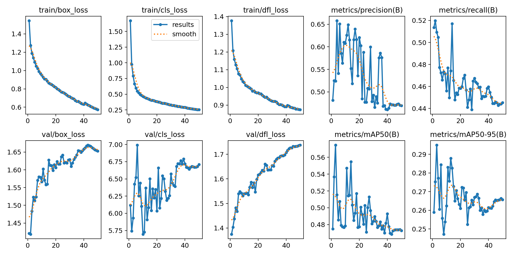
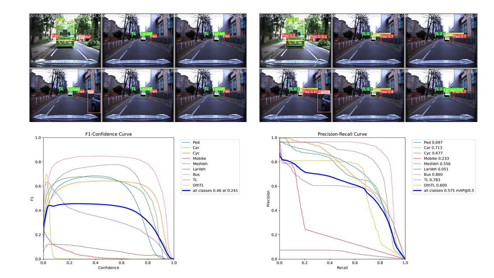
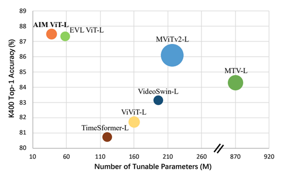
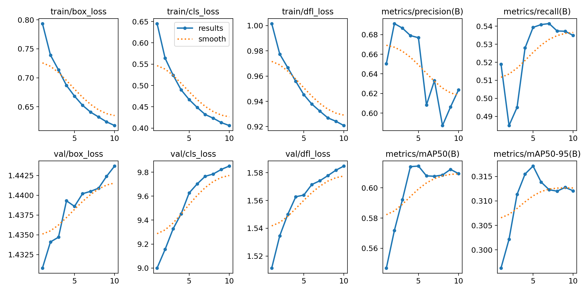

## Overview
```
|——base-datasets
|   |——act-and-loc-datasets
|   |   |——datasets
|   |   |   |——train
|   |   |   |——valid
|   |——datasets
|   |   |——road-r
|   |   |   |——train
|   |   |   |——valid
|——semi-datasets
|   |——semi-det-agent
|   |   |——road-r
|   |   |   |——train
|   |   |   |——valid
```
## Training Yolov8 Model

### Step-1: Data Preparation

```
python utils/road2yolo.py
```

In the first stage of model training, we use the YOLOv8 algorithm to detect the type and bounding box of the agent in each video frame. Specifically, we use [ultralytics](https://github.com/ultralytics/ultralytics)’ official yolov8l.pt model as the pre-training model. During the training process, we only used the supervision information in the three videos 2014-07-14-14-49-50_stereo_centre_01, 2015-02-03-19-43-11_stereo_centre_04, 2015-02-24-12-32-19_stereo_centre_04, As shown in [main-yolov8.py](./main-yolov8.py). The data preprocessing code is shown in [road2yolo.py](utils/road2yolo.py).

### Step-2: Training Yolov8
Execute the script "main-yolov8.py" to train Yolov8 for 50 epochs, resulting in the "best.pt" model.
```
python main-yolov8.py
```
The input size of the video frame is 1280*960, and the batch-size is set to 4 (See the [code](./main-yolov8.py) for more details).

<!--  -->

## Second-stage: Action and Location Multi-label classification

### Step-3: Data Processing for Second-Stage Model

In the second stage of model training, we still use the annotation data in the three videos mentioned above (2014-07-14-14-49-50_stereo_centre_01, 2015-02-03-19-43-11_stereo_centre_04, 2015-02-24-12-32-19_stereo_centre_04), and extract target sequence images of different types of agents as training sets.
```
python utils/act-and-loc-data_processor.py
```
Use "train_stage_two-large.py" to train the second-stage model, producing two best models: "best_weights.pt" (lowest loss) and "best_acc_weights.pt" (highest accuracy)

### Step-4: Action and Location Classifier



First, we extract the regional image sequences of agents in the video as input, and use the AIM-Vit-L model proposed in ["AIM: Adapting Image Models for Efficient Video Action Recognition" (ICLR 2023)](https://openreview.net/pdf?id=CIoSZ_HKHS7) as the action and location classifier. We changed the loss function in the training phase to the sigmoid_focal_loss function and trained for 10 epochs.

```
python train_stage_two-large.py --dataset_path base-datasets/act-and-loc-datasets/datasets --window_size 4 --head_mode 2d --model vit_clip_pro --use_local
```

## Inference
### Step-5: Code Modification
Modify the official Yolov8 code by replacing the ["ultralytics"](./ultralytics) folder on GitHub with the same-named folder in your Anaconda virtual environment's site-packages directory. This change allows you to obtain confidence information for all agents predicted by Yolov8, not just the highest-confidence agent as in the original code.

### Step-6: Inference on Test Set
```
python inference-stage-two-no-agent-id.py --yolo_path runs/detect/yolov8l_base_1280_batch_4_agent/weights/best.pt --classifier_path runs/exp-stage2-vit_clip-2023-10-21-22_46_31/weight/best_acc_weight.pt  --windows_size 4 --yolo_name base --test_mode test
```
Run the ["inference-stage-two-no-agent-id.py"](inference-stage-two-no-agent-id.py) script to perform inference on the test set video data, generating a .pkl file in the output folder.

### Step-7: Submission of Results (Version 1)
Copy the path to the .pkl file and execute ["utils/submit_requirement_for_task1.py"](utils/submit_requirement_for_task1.py) to obtain results that align with the [243 logical constraints](requirements/requirements_readable.txt). Package the final output .pkl file into a .zip file and submit it.

### Step-8: Pseudo Labeling and Fine-Tuning
Specify the .pkl file path from Version 1 and execute ["utils/pseudo_label2yolo.py"](utils/pseudo_label2yolo.py) to generate pseudo labels for the remaining training set videos in the semi-datasets folder. Merge the data from the training set in base-datasets with the pseudo-labeled data in semi-datasets.

### Step-9: Fine-Tuning Best Model
Use the mixed semi-datasets for fine-tuning the "best.pt" model from Step 2 for 10 additional epochs, resulting in a new best model (best-v2.pt).
```
python semi-yolov8.py
```

### Step-10: Inference with best-v2 Model (Version 2)
```
python inference-stage-two-no-agent-id.py --yolo_path runs/detect/yolov8l_semi_1280_batch_4_agent/weights/best.pt --classifier_path runs/exp-stage2-vit_clip-2023-10-21-22_46_31/weight/best_acc_weight.pt  --windows_size 4 --yolo_name semi --test_mode test
```
Specify the path of "best-v2.pt" in "inference-stage-two-no-agent-id.py" and run inference on the test set video data again. Adjust "[utils/submit_requirement_for_task1.py](utils/submit_requirement_for_task1.py)" to obtain Version 2 of the .pkl file.
[submit_requirement_for_task1.py](utils/submit_requirement_for_task1.py) is used to post-process the prediction results according to the logical constraints in [requirements](requirements/requirements_dimacs.txt).

### Step-11: Baseline Results (Version 3):

Use the baseline source code (https://github.com/mihaela-stoian/ROAD-R-2023-Challenge) to generate Version 3 of the .pkl file.

### Step-12: Integration of Versions 1-3 (Version 4):

Place the .pkl files from Versions 1 and 2 in the "test-merge" folder. Specify "pkldirs" in "integration_models.py" as the "test-merge" folder path and "bestlocation" as the path to the Version 3 .pkl file. Run "integration_models.py" to obtain "submit-task1.pkl." Adjust ["utils/submit_requirement_for_task1.py"](utils/submit_requirement_for_task1.py) to get Version 4 of the .pkl file.

### Step-13: Integration of Versions 1-2 (Version 5):

Place the .pkl files from Versions 1 and 2 in the "test-merge" folder. Specify "pkldirs" in "integration_models.py" as the "test-merge" folder path and comment out lines 78-92 in "integration_models.py" to obtain a new "submit-task1.pkl." Adjust ["utils/submit_requirement_for_task1.py"](utils/submit_requirement_for_task1.py) to get Version 5 of the .pkl file.

## Results
We are using three videos in "val_1" to evaluate our method. The evaluation code is ["utils/eval_mAP.py"](utils/eval_mAP.py). The comparison results are as follows: 

|    Method    | f-mAP@0.5 | agent mAP | action mAP | location mAP |
|:------------:|:---------:|:---------:|:----------:|:------------:|
| [3D-RetinaNet (Version 3)](https://github.com/mihaela-stoian/ROAD-R-2023-Challenge) |    0.180   |    0.251   |    0.130    |     0.199     |
|  Ours (Version 1) |    0.282   |    0.466   |    0.205    |     0.250     |
|  Ours (Version 2) |    0.291   |    0.480   |    **0.212**    |     0.259     |
|  Ours (Version 4) |    **0.293**   |    **0.484**   |    0.211    |     **0.264**     |
|  Ours (Version 5) |    0.291   |    **0.484**   |    0.211    |     0.258     |


## Requirement
`
Python 3.8.16,
We achieve equivalent results on NVIDIA GeForce RTX 3090 (cuda V11.5).
`

## Acknowledgments

Our code is implemented based on [ROAD-R-2023-Challenge](https://github.com/mihaela-stoian/ROAD-R-2023-Challenge)、[ultralytics](https://github.com/ultralytics/ultralytics)、[adapt-image-models](https://github.com/taoyang1122/adapt-image-models) and [ROADpp_challenge_ICCV2023](https://github.com/ricky-696/ROADpp_challenge_ICCV2023), thanks to these outstanding work.